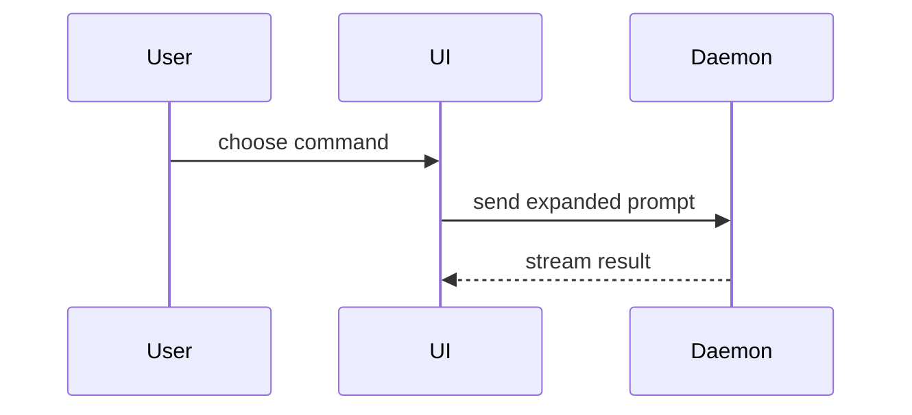

# Show Me

Help the user understand the current topic visually. Pick the smallest view that makes the key point clear.

## Choose a form

| Question shape | Prefer |
| --- | --- |
| Logic or algorithm | Pseudocode |
| Runtime control flow | Call tree |
| UI composition | Component tree |
| File responsibility or broad refactor | Shallow file tree |
| Component interaction, control flow, or data movement | Mermaid |
| Change to an existing shape | Fenced `diff` |
| Mostly new, copyable code | Complete code block |
| Dense visual UI, layout, state comparison, or concept | Focused HTML artifact |

## Logic and flow

Show an algorithm as pseudocode:

```text
on(save)
  if content is unchanged
    return cached result
  write new content
  return fresh result
```

Show runtime control flow as a call tree:

```text
submitForm
  createSession
    persistPrompt
    launchAgent
  navigateToSession
```

Show component interaction, control flow, or data flow with Mermaid:



## Structure

Show UI composition as a component tree. Include only state and module boundaries that matter:

```tsx
<SessionPage> (apps/example/src/routes/session.tsx)
  useSessionEvents()
  <SessionToolbar>
    <RunSkillButton /> (packages/ui)
  <SessionTimeline>
```

Show file responsibility or a broad refactor as a shallow file tree:

```text
src/
├── commands/       # parses user actions
├── sessions/       # owns session state
└── transport/      # sends API requests
```

## Changes

Use a fenced `diff` when the surrounding shape already exists. Match the diff to the topic.

Component change:

```diff
 <SessionPage>
   <SessionToolbar>
+    <RunSkillButton />
   <SessionTimeline>
+    <SkillResultCard />
```

File-layout change:

```diff
 src/
 ├── commands/
+│   └── show-me.ts       # expands the slash command
 ├── sessions/
-└── transport.ts
+└── transport/
+    ├── client.ts
+    └── stream.ts
```

Call-tree or call-stack change:

```diff
 submitForm
   createSession
     persistPrompt
+    expandSkillMention
     launchAgent
-  navigateToSession
+  navigateToSession
+    subscribeEvents
```

State or control-flow change:

```diff
 on(save)
-  write content
+  if content is unchanged
+    return cached result
+  write content
+  invalidate cache
```

## New code

Show the complete block when most of it is new, omitted context would hide ownership or order, or the user needs a copyable target:

```ts
function expandSkill(command: string): string {
  const skillName = command.slice(1)
  return `use the ${skillName} skill`
}
```

## HTML artifacts

For a visual UI, layout, state comparison, or concept too dense for Mermaid, write one focused HTML file: a diagram, infographic, or slide deck.

- Match the product's colors, type, spacing, components, labels, and data.
- Support desktop and mobile.
- Place the artifact outside product source unless the user requested a repository change.
- Open it through an available presentation mechanism rather than assuming a platform-specific command.
- If opening is unavailable, give the user its path and say that it was not opened.

## Constraints

- Place each visual next to the text it supports.
- Keep only the calls, files, props, states, and boundaries needed for the current question or the options that resolve the current discussion point.
- Choose the visual forms that fit the question.
