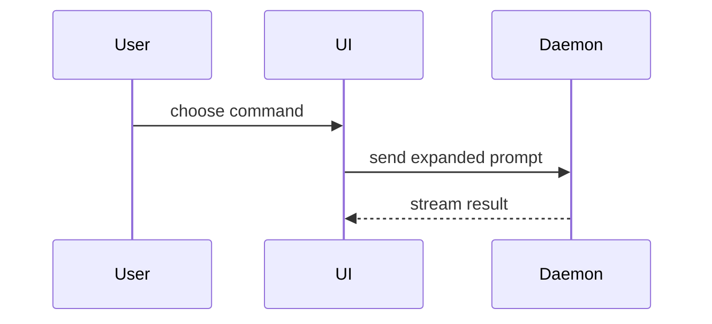

Help the user understand the current topic of conversation visually. Skip the preamble and keep prose brief. Pick the smallest view that makes the key point clear.

- Show logic or an algorithm as pseudocode:

```text
on(save)
  if content is unchanged
    return cached result
  write new content
  return fresh result
```

- Show runtime control flow as a call tree:

```text
submitForm
  createSession
    persistPrompt
    launchAgent
  navigateToSession
```

- Show UI structure as a component tree, including state and module boundaries that matter:

```tsx
<SessionPage> (apps/example/src/routes/session.tsx)
  useSessionEvents()
  <SessionToolbar>
    <RunSkillButton> (packages/ui)
```

- Show file responsibility or a broad refactor as a shallow file tree:

```text
src/
├── commands/       # parses user actions
├── sessions/       # owns session state
└── transport/      # sends API requests
```

- Show component interaction, control flow, or data flow with Mermaid:


```mermaid
sequenceDiagram
    participant User
    participant UI
    participant Daemon
    User->>UI: choose command
    UI->>Daemon: send expanded prompt
    Daemon-->>UI: stream result
```

- Use `diff` when the point is what changes and the surrounding shape already exists. Match the diff shape to the topic.

For a component change:

```diff
 <SessionPage>
   useSessionEvents()
   <SessionToolbar>
+    <RunSkillButton />
   <SessionTimeline>
+    <SkillResultCard />
```

For a file-layout change:

```diff
 src/
 ├── commands/
+│   └── show-me.ts       # expands the slash command
 ├── sessions/
-└── transport.ts
+└── transport/
+    ├── client.ts
+    └── stream.ts
```

For a call-tree or call-stack change:

```diff
 submitForm
   createSession
     persistPrompt
+    expandSkillMention
     launchAgent
-  navigateToSession
+  navigateToSession
+    subscribeToEvents
```

For a state or control-flow change:

```diff
 on(save)
-  write content
+  if content is unchanged
+    return cached result
+  write new content
+  invalidate cache
```

- Show the whole block when most of it is new, when omitted context would hide ownership or order, or when the user needs a copyable target shape:

```ts
function expandSkill(command: string): string {
  const skillName = command.slice(1)
  return `use the ${skillName} skill`
}
```

- For a visual UI, layout, state comparison, or concept too dense for Mermaid, write one focused HTML file. Use a diagram, an infographic, or a short slide deck, whichever fits the point. Match the product's colors, type, spacing, and components; use real labels and data; support desktop and mobile. Before writing HTML, read the installed `lavish-axi --help` and each relevant `lavish-axi playbook <id>` for the artifact. Place the artifact outside product source unless the user requested a repository change. Keep local assets beside the HTML and use relative paths.

Serve it for the user through the installed Lavish integration:

```sh
lavish-axi path/to/show-me-{description}.html --no-open
```

Use the URL returned by the configured CLI, including its remote-host rewrite, and check that it serves the actual artifact. Do not substitute an agent-local localhost URL or rely on opening a browser on the SSH host. If a reachable private link is unavailable, provide the file path and report that browser delivery is blocked. Do not use `lavish-axi share`, which publishes to a third-party service.

Follow the CLI's current feedback lifecycle. Keep `lavish-axi poll <html-file>` attached to this agent through the foreground or a supported completion-aware facility; do not claim monitoring without a live feedback path. Read returned feedback completely, resume a timed-out poll when appropriate, and do not reopen a user-ended review uninvited. End the review only when complete or requested.

### Guidance

Place each visual next to the short text it supports. Keep only the calls, files, props, states, and boundaries needed to answer the user's current question or the options to resolve the current discussion point.

You may use one of these, you may use several, it is unlikely you will use all of them. Use your judgement and don't overwhelm the user.
