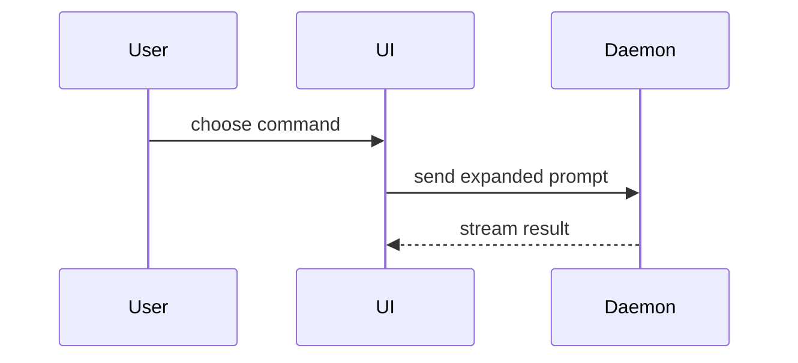

Help the user understand the current topic of conversation visually.
Skip the preamble and keep prose brief and subordinate to the visual.
Pick the smallest view that makes the key point clear, where "smallest" means the least unnecessary information rather than the smallest physical output.
Prefer terminal-native visualization, including rendered Mermaid.
Use enough space to make structure, scale, sequence, causality, or contrast perceptible.
Compose the visual deliberately with alignment, containment, labeled connectors, lanes, grouping, scale, or other encodings that carry meaning.
Use one coherent view when it is sufficient.
Use multiple coordinated views when each answers a distinct question needed to understand the topic.

Choose any terminal-native encoding that makes the important relationship directly visible.
The formats below are non-exhaustive examples.

- Use a composed text diagram when spatial arrangement, containment, ownership, or labeled connections matter:

```text
                       request path
┌──────────┐      ┌──────────────┐      ┌────────────┐
│  Client  │─────▶│    Router    │─────▶│  Handler   │
└──────────┘      │ auth + match │      └─────┬──────┘
                  └──────────────┘            │
                                              ▼
                                      ┌──────────────┐
                                      │  Repository  │
                                      └──────┬───────┘
                                             │ SQL
                                             ▼
                                      ┌──────────────┐
                                      │   Database   │
                                      └──────────────┘
```

- Show logic or an algorithm as pseudocode:

```text
on(save)
  if content is unchanged
    return cached result
  write new content
  return fresh result
```

- Show runtime control flow as a call tree:

```text
submitForm
  createSession
    persistPrompt
    launchAgent
  navigateToSession
```

- Show UI structure as a component tree, including state and module boundaries that matter:

```tsx
<SessionPage> (apps/example/src/routes/session.tsx)
  useSessionEvents()
  <SessionToolbar>
    <RunSkillButton> (packages/ui)
```

- Show file responsibility or a broad refactor as a shallow file tree:

```text
src/
├── commands/       # parses user actions
├── sessions/       # owns session state
└── transport/      # sends API requests
```

- Use Mermaid when its automatic layout makes a flowchart, state diagram, sequence diagram, class diagram, or entity-relationship diagram clearer.
Pi renders supported Mermaid fences as themed Unicode terminal diagrams, so keep the graph within a practical terminal width:



- Use `diff` when the point is what changes and the surrounding shape already exists.
Match the diff shape to the topic.

For a component change:

```diff
 <SessionPage>
   useSessionEvents()
   <SessionToolbar>
+    <RunSkillButton />
   <SessionTimeline>
+    <SkillResultCard />
```

For a file-layout change:

```diff
 src/
 ├── commands/
+│   └── show-me.ts       # expands the slash command
 ├── sessions/
-└── transport.ts
+└── transport/
+    ├── client.ts
+    └── stream.ts
```

For a call-tree or call-stack change:

```diff
 submitForm
   createSession
     persistPrompt
+    expandSkillMention
     launchAgent
-  navigateToSession
+  navigateToSession
+    subscribeToEvents
```

For a state or control-flow change:

```diff
 on(save)
-  write content
+  if content is unchanged
+    return cached result
+  write content
+  invalidate cache
```

- Show the whole block when most of it is new, when omitted context would hide ownership or order, or when the user needs a copyable target shape:

```ts
function expandSkill(command: string): string {
  const skillName = command.slice(1)
  return `use the ${skillName} skill`
}
```

- Use proportional bars, aligned values, a comparison matrix, a timeline, or parallel lanes when magnitude, ordering, tradeoffs, chronology, concurrency, or responsibility is the point.
Include labels and a scale or legend when the encoding would otherwise be ambiguous.

- Follow the `lavish` skill's selection and review workflow only when interaction, responsive layout, dense spatial relationships, or required visual fidelity cannot be preserved clearly in the terminal.
Do not use Lavish merely because the terminal visual is substantial.

## Guidance

Place each visual next to the short text it supports.
Build the visual around the question the user is trying to answer, not around a preferred notation.
Keep only the calls, files, props, states, values, and boundaries needed to answer that question or resolve the current discussion point.
A visual may be physically large when the space communicates a material relationship.
Use several formats or coordinated panels only when each contributes distinct necessary understanding.
Do not overwhelm the user.
